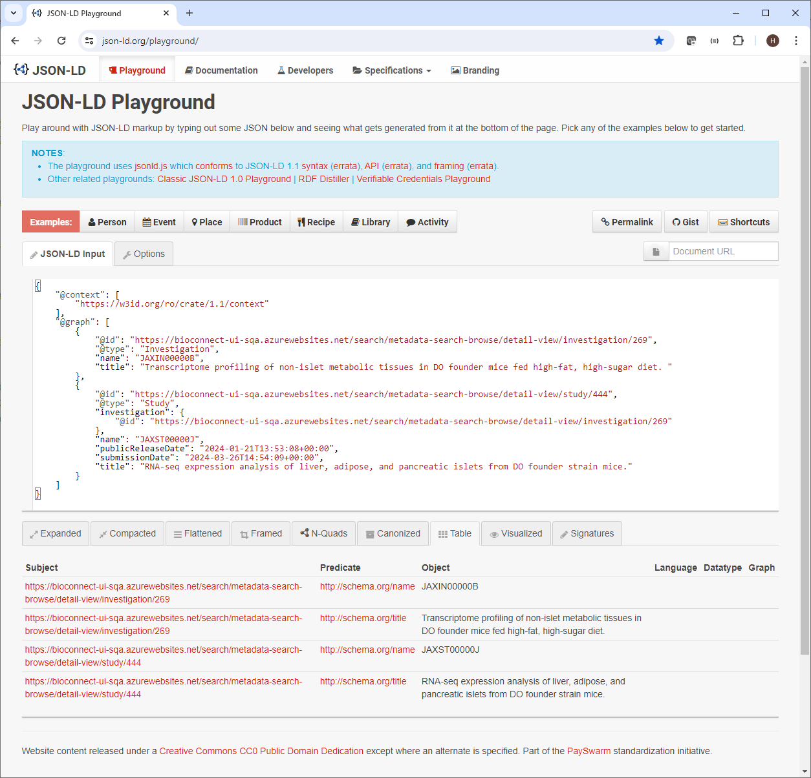
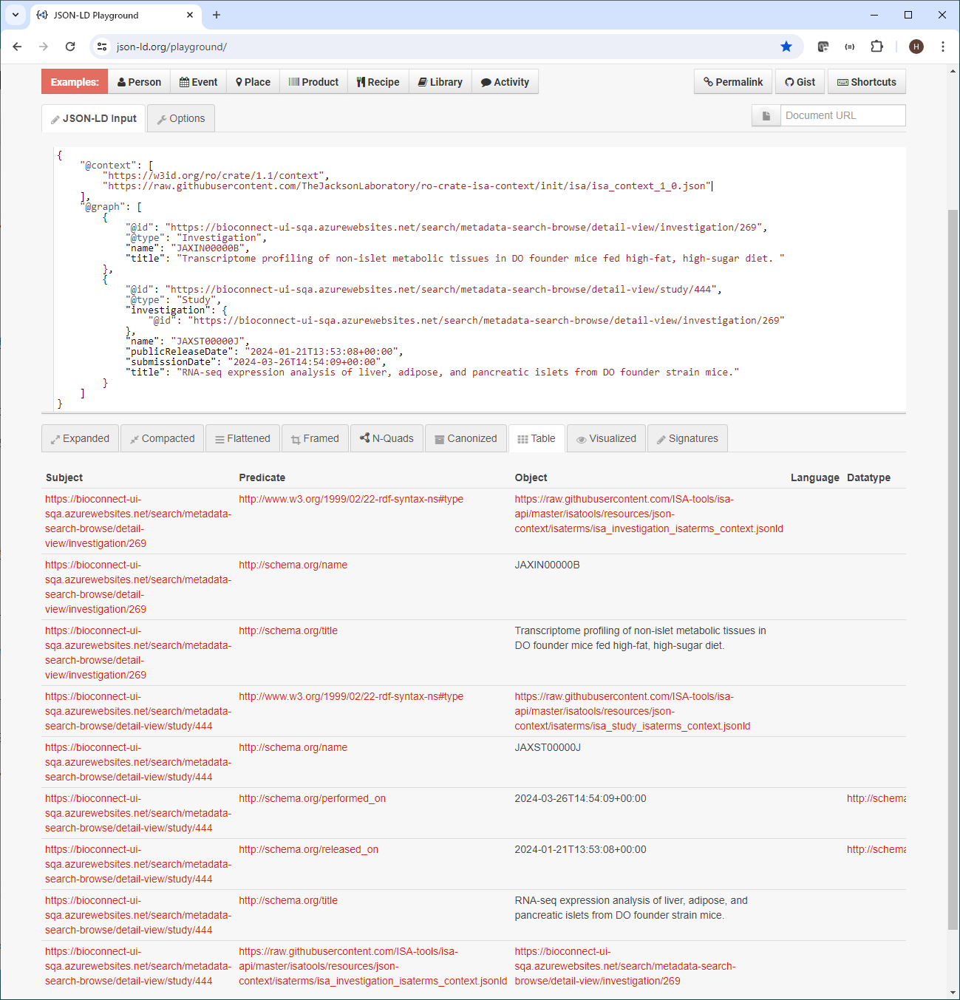

# RO-Crate ISA Context

This is a public repository for ISA context files. The urls for these files can be added into the
"@context" section of "ro-crate-metadata.json", without any changes of the data in "@graph" section. 
The result is that more ISA data in "@graph" section will be parsable by the most RDF tools. User can extract 
more information with the same data in "ro-crate-metadata.json"

## Background Information
The ro-crate is a great way to package all the data in a single deliverable json file. However, when ISA data
is packaged into the "ro-crate-metadata.json", some schema information are not included in the json file, and 
RDF parsing tools can not figure out data type and end up throw away these linkable data.

## Simple Example
to illustrate the more data will be extracted with our ISA context file, we can use a simple "ro-crate-metadata.json" JSON-LD 
file to see the difference, plug it into the [JSON-LD Playground](https://json-ld.org/playground/) to see how many triples we
can get.

Here is a example JSON-LD file. To make it simple, we deleted some ro-crate nodes.
```
{
    "@context": [
        "https://w3id.org/ro/crate/1.1/context"
    ],
    "@graph": [
        {
            "@id": "https://bioconnect-ui-sqa.azurewebsites.net/search/metadata-search-browse/detail-view/investigation/269",
            "@type": "Investigation",
            "name": "JAXIN00000B",
            "title": "Transcriptome profiling of non-islet metabolic tissues in DO founder mice fed high-fat, high-sugar diet. "
        },
        {
            "@id": "https://bioconnect-ui-sqa.azurewebsites.net/search/metadata-search-browse/detail-view/study/444",
            "@type": "Study",
            "investigation": {
                "@id": "https://bioconnect-ui-sqa.azurewebsites.net/search/metadata-search-browse/detail-view/investigation/269"
            },
            "name": "JAXST00000J",
            "publicReleaseDate": "2024-01-21T13:53:08+00:00",
            "submissionDate": "2024-03-26T14:54:09+00:00",
            "title": "RNA-seq expression analysis of liver, adipose, and pancreatic islets from DO founder strain mice."
        }
    ]
}
```

If we paste the file content into the [JSON-LD Playground](https://json-ld.org/playground/), we can see there are 4 triples in the graph, 
two for investigation and two for study.



Now we just add an URL to point our ISA context schema file in this repository:
```
"https://raw.githubusercontent.com/TheJacksonLaboratory/ro-crate-isa-context/init/isa/isa_context_1_0.json"
```
Here is the entire file:

```
{
    "@context": [
        "https://w3id.org/ro/crate/1.1/context",
        "https://raw.githubusercontent.com/TheJacksonLaboratory/ro-crate-isa-context/init/isa/isa_context_1_0.json"
    ],
    "@graph": [
        {
            "@id": "https://bioconnect-ui-sqa.azurewebsites.net/search/metadata-search-browse/detail-view/investigation/269",
            "@type": "Investigation",
            "name": "JAXIN00000B",
            "title": "Transcriptome profiling of non-islet metabolic tissues in DO founder mice fed high-fat, high-sugar diet. "
        },
        {
            "@id": "https://bioconnect-ui-sqa.azurewebsites.net/search/metadata-search-browse/detail-view/study/444",
            "@type": "Study",
            "investigation": {
                "@id": "https://bioconnect-ui-sqa.azurewebsites.net/search/metadata-search-browse/detail-view/investigation/269"
            },
            "name": "JAXST00000J",
            "publicReleaseDate": "2024-01-21T13:53:08+00:00",
            "submissionDate": "2024-03-26T14:54:09+00:00",
            "title": "RNA-seq expression analysis of liver, adipose, and pancreatic islets from DO founder strain mice."
        }
    ]
}
```

we pasted into [JSON-LD Playground](https://json-ld.org/playground/) again, and now can see there are 9 triples


## How the ISA context increases the linkable data
When a parser extracts the triples from JSON-LD, it needs to map terms to the IRIs, which the context. 
Contexts can either be directly embedded into the document (an embedded context) or be referenced using a URL.
When I add the ISA context URL into the "@context" section of  "ro-crate-metadata.json" JSON-LD file, We expanded
ISA context so more data will be understandable by the parser. 

There are three types of context to make the ISA data more parsable:
- Use uppercase ISA model objects to match the entry has the "@type" defined, such as "@type": "Study"
- Use lowercase ISA model objects to match the fields which use the lower case, such as the "investigation":"uri" in the study object
- Manually define mapping for the fields which are not ISA object type such as "submissionDate", "annotationValue", using the same 
as in ISA schema definition

## Experiment
To see how much more information we can get, we take 240 "ro-crate-metadata.json" files and use 
[python rdflib](https://pypi.org/project/rdflib/). We compare the triples extracted with and without our ISA context.
Here is the result:

Number of Triples Read from rdflib

| File Name | # of Triples <br/>No ISA Context    |  # of Triples <br/>with ISA Conect    | Difference | Increase<br/>Percentage (%) |
| :----- | ---: | ---: | ---: | :---: |
|20230324_195803_574.zip|18212|23704|5492|30.2|
|20230324_195915_575.zip|26981|35289|8308|30.8|
|20230324_202404_578.zip|15221|21997|6776|44.5|
|20230324_202405_579.zip|1005|1469|464|46.2|
|20230324_202459_580.zip|105479|118085|12606|12.0|
|20230324_202505_581.zip|348|512|164|47.1|
|20230324_202526_582.zip|38098|46996|8898|23.4|
|20230324_202552_583.zip|348|512|164|47.1|
|20230324_202627_584.zip|6085|7930|1845|30.3|
|20230324_203059_585.zip|284|464|180|63.4|
|20230324_204636_589.zip|4449|5962|1513|34.0|
|20230324_204942_592.zip|13520|17688|4168|30.8|
|20230324_205049_593.zip|4449|5962|1513|34.0|
|20230324_205151_596.zip|4449|5962|1513|34.0|
|20230324_205301_598.zip|4449|5962|1513|34.0|
|20230324_205326_599.zip|4449|5962|1513|34.0|
|20230324_205354_600.zip|6085|7930|1845|30.3|
|20230324_212123_603.zip|20150|26630|6480|32.2|
|20230324_213001_604.zip|25116|32865|7749|30.9|
|20230325_230512_605.zip|18212|23704|5492|30.2|
|20230331_165817_606.zip|149910|197916|48006|32.0|
|20230405_173736_607.zip|2652|3554|902|34.0|
|20230425_142800_608.zip|6275|8104|1829|29.1|
|20230425_143829_609.zip|25330|32850|7520|29.7|
|20230501_194936_610.zip|18267|23779|5512|30.2|
|20230502_171635_611.zip|12855|17330|4475|34.8|
|20230502_175256_612.zip|33316|44074|10758|32.3|
|20230502_183451_613.zip|167989|222196|54207|32.3|
|20230509_162418_614.zip|20359|26537|6178|30.3|
|20230510_153844_615.zip|18272|23794|5522|30.2|
|20230510_155623_616.zip|16644|21344|4700|28.2|
|20230510_184103_617.zip|18258|23773|5515|30.2|
|20230511_204503_618.zip|4181|5424|1243|29.7|
|20230511_205117_620.zip|367|520|153|41.7|
|20230511_205240_622.zip|163|253|90|55.2|
|20230512_191759_623.zip|14406|18310|3904|27.1|
|20230512_192133_624.zip|163|253|90|55.2|
|20230523_200221_625.zip|14406|18310|3904|27.1|
|20230523_202501_626.zip|18253|23758|5505|30.2|
|20230531_194820_631.zip|1327|2294|967|72.9|
|20230531_202143_632.zip|11971|37469|25498|213.0|
|20230607_153015_633.zip|4193|7928|3735|89.1|
|20230616_191504_634.zip|6411|11957|5546|86.5|
|20230616_193454_635.zip|7981|24771|16790|210.4|
|20230616_194320_636.zip|8252|25164|16912|204.9|
|20230616_194911_637.zip|17742|45745|28003|157.8|
|20230616_195415_638.zip|8301|12981|4680|56.4|
|20230621_224337_639.zip|392|674|282|71.9|
|20230622_164111_640.zip|2015|3628|1613|80.0|
|20230622_164117_641.zip|1173|1868|695|59.2|
|20230622_164128_642.zip|1314|2196|882|67.1|
|20230622_164752_643.zip|4470|8468|3998|89.4|
|20230623_203930_644.zip|6463|12044|5581|86.4|
|20230623_204302_645.zip|3606|6668|3062|84.9|
|20230623_204403_646.zip|6463|12044|5581|86.4|
|20230626_205226_647.zip|26109|40614|14505|55.6|
|20230626_210726_648.zip|7367|12296|4929|66.9|
|20230626_211511_649.zip|1733|2984|1251|72.2|
|20230626_212015_650.zip|713|1550|837|117.4|
|20230626_221719_651.zip|901|1456|555|61.6|
|20230628_131531_652.zip|10103|17638|7535|74.6|
|20230628_162913_653.zip|10115|17679|7564|74.8|
|20230628_164700_654.zip|29853|46458|16605|55.6|
|20230629_191117_655.zip|10103|17528|7425|73.5|
|20230629_191415_656.zip|2840|5105|2265|79.8|
|20230629_191928_657.zip|195|301|106|54.4|
|20230629_193949_658.zip|8673|13554|4881|56.3|
|20230629_194022_659.zip|24141|42027|17886|74.1|
|20230629_194206_660.zip|16877|27980|11103|65.8|
|20230629_194220_661.zip|3851|5637|1786|46.4|
|20230629_194227_662.zip|495|668|173|34.9|
|20230703_202941_663.zip|6073|10759|4686|77.2|
|20230707_141255_664.zip|7741|15270|7529|97.3|
|20230707_142109_665.zip|2235|4515|2280|102.0|
|20230707_142119_666.zip|369|480|111|30.1|
|20230707_144424_667.zip|9475|19168|9693|102.3|
|20230707_144739_668.zip|222|345|123|55.4|
|20230721_203028_669.zip|7709|15215|7506|97.4|
|20230721_204125_670.zip|228|368|140|61.4|
|20230721_204441_671.zip|7709|15215|7506|97.4|
|20230721_204619_672.zip|8630|13501|4871|56.4|
|20230721_204641_673.zip|1916|3541|1625|84.8|
|20230721_215333_674.zip|1623|3158|1535|94.6|
|20230721_215342_675.zip|2507|4457|1950|77.8|
|20230821_142117_676.zip|61029|115885|54856|89.9|
|20230821_201611_677.zip|1596|2878|1282|80.3|
|20230822_160217_678.zip|5890|10819|4929|83.7|
|20230825_201946_679.zip|175|291|116|66.3|
|20230825_202002_680.zip|1317|3055|1738|132.0|
|20230825_204352_681.zip|175|291|116|66.3|
|20230825_210843_682.zip|175|291|116|66.3|
|20230825_211443_683.zip|7708|15209|7501|97.3|
|20230825_211543_684.zip|1108|1780|672|60.6|
|20230825_211604_685.zip|175|291|116|66.3|
|20230825_211606_686.zip|1450|3285|1835|126.6|
|20230825_211726_687.zip|175|291|116|66.3|
|20230825_211802_688.zip|175|291|116|66.3|
|20230828_202631_689.zip|5382|10674|5292|98.3|
|20230828_203529_690.zip|225|368|143|63.6|
|20230829_132059_691.zip|56449|86958|30509|54.0|
|20230829_134458_692.zip|8628|13475|4847|56.2|
|20230829_140859_693.zip|4930|9632|4702|95.4|
|20230829_143630_694.zip|47539|95304|47765|100.5|
|20230830_133716_695.zip|47366|93716|46350|97.9|
|20230831_124746_696.zip|8628|13475|4847|56.2|
|20230831_125205_697.zip|3370|5830|2460|73.0|
|20230901_133532_698.zip|8628|13475|4847|56.2|
|20230905_203358_699.zip|8628|13475|4847|56.2|
|20230905_203539_700.zip|131580|226389|94809|72.1|
|20230907_193625_701.zip|60147|113316|53169|88.4|
|20230908_195439_702.zip|7708|15209|7501|97.3|
|20230912_211925_703.zip|294|476|182|61.9|
|20230913_195546_704.zip|1756|3333|1577|89.8|
|20230913_200442_705.zip|24528|46247|21719|88.5|
|20230929_125821_706.zip|1811|3869|2058|113.6|
|20230929_131158_707.zip|1992|3647|1655|83.1|
|20230929_131927_708.zip|1992|3647|1655|83.1|
|20231006_200854_709.zip|4930|9632|4702|95.4|
|20231006_200940_710.zip|1595|2874|1279|80.2|
|20231006_205038_711.zip|11222|29570|18348|163.5|
|20231010_205114_712.zip|10509|21225|10716|102.0|
|20231017_175230_713.zip|321|529|208|64.8|
|20231020_102519_714.zip|7708|15209|7501|97.3|
|20231020_102942_715.zip|8685|13549|4864|56.0|
|20231020_115325_716.zip|8685|13549|4864|56.0|
|20231020_161850_717.zip|2149|3591|1442|67.1|
|20231020_163450_718.zip|8685|13549|4864|56.0|
|20231020_193817_719.zip|1756|3333|1577|89.8|
|20231025_142339_720.zip|499|672|173|34.7|
|20231025_143050_721.zip|217|378|161|74.2|
|20231030_150601_722.zip|60149|113340|53191|88.4|
|20231103_192450_723.zip|2166|3978|1812|83.7|
|20231103_193951_724.zip|580|1204|624|107.6|
|20231103_194104_725.zip|1592|2865|1273|80.0|
|20231103_194114_726.zip|343|642|299|87.2|
|20231115_142529_727.zip|23986|40399|16413|68.4|
|20231115_142537_728.zip|23985|40396|16411|68.4|
|20231115_142542_729.zip|23940|40333|16393|68.5|
|20231117_202747_730.zip|650|1195|545|83.8|
|20231121_215631_731.zip|5917|10824|4907|82.9|
|20231125_164954_732.zip|543|894|351|64.6|
|20231127_184147_733.zip|2149|3591|1442|67.1|
|20231130_160153_734.zip|56449|86978|30529|54.1|
|20231130_181744_735.zip|2237|4472|2235|99.9|
|20231201_210201_736.zip|678|1195|517|76.3|
|20231205_134918_737.zip|2434|4655|2221|91.2|
|20231206_164438_738.zip|1756|3333|1577|89.8|
|20231206_164446_739.zip|2149|3591|1442|67.1|
|20231206_164629_740.zip|1756|3333|1577|89.8|
|20231207_141554_741.zip|2149|3591|1442|67.1|
|20231207_141558_742.zip|2149|3591|1442|67.1|
|20231208_205556_743.zip|1912|3859|1947|101.8|
|20231212_224759_744.zip|15951|26916|10965|68.7|
|20231213_214515_745.zip|10689|22110|11421|106.8|
|20231213_215726_746.zip|7946|16180|8234|103.6|
|20240108_203716_747.zip|9122|18469|9347|102.5|
|20240108_203730_748.zip|9098|18416|9318|102.4|
|20240112_133353_749.zip|2259|4142|1883|83.4|
|20240112_162358_750.zip|9128|18507|9379|102.7|
|20240126_213139_755.zip|9261|18852|9591|103.6|
|20240126_213212_756.zip|9261|18852|9591|103.6|
|20240126_213228_757.zip|384|718|334|87.0|
|20240126_214542_758.zip|819|1886|1067|130.3|
|20240202_175947_759.zip|9263|19077|9814|105.9|
|20240205_164252_760.zip|5680|11484|5804|102.2|
|20240226_183536_761.zip|2242|4521|2279|101.7|
|20240228_142044_762.zip|1977|3832|1855|93.8|
|20240228_182638_763.zip|2333|4546|2213|94.9|
|20240229_175216_764.zip|9113|18450|9337|102.5|
|20240301_204938_769.zip|1403|3246|1843|131.4|
|20240301_205355_770.zip|5860|15192|9332|159.2|
|20240301_205615_771.zip|5860|15192|9332|159.2|
|20240301_210144_772.zip|5860|15192|9332|159.2|
|20240301_211509_773.zip|254|582|328|129.1|
|20240301_211803_774.zip|9358|30019|20661|220.8|
|20240304_234039_775.zip|5860|15192|9332|159.2|
|20240304_234158_776.zip|10326|33164|22838|221.2|
|20240307_192915_777.zip|5860|15192|9332|159.2|
|20240308_171013_778.zip|5860|15192|9332|159.2|
|20240311_190504_779.zip|5861|15250|9389|160.2|
|20240311_190514_780.zip|5861|15250|9389|160.2|
|20240311_191712_781.zip|5939|15408|9469|159.4|
|20240311_191741_782.zip|2063|4762|2699|130.8|
|20240313_151124_783.zip|5939|15408|9469|159.4|
|20240313_151134_784.zip|3688|9807|6119|165.9|
|20240326_145409_785.zip|942|3215|2273|241.3|
|20240328_140444_786.zip|1406|3276|1870|133.0|
|20240328_140643_787.zip|5954|15432|9478|159.2|
|20240401_150526_788.zip|3688|9807|6119|165.9|
|20240401_150532_789.zip|1409|3285|1876|133.1|
|20240412_213555_790.zip|598|1574|976|163.2|
|20240412_213855_791.zip|598|1574|976|163.2|
|20240412_214110_792.zip|598|1574|976|163.2|
|20240412_214130_793.zip|8463|27474|19011|224.6|
|20240412_221545_794.zip|5954|15432|9478|159.2|
|20240412_222440_795.zip|858|2100|1242|144.8|
|20240412_232543_790.zip|5957|15435|9478|159.1|
|20240415_000924_791.zip|2091|4794|2703|129.3|
|20240415_004319_792.zip|895|2184|1289|144.0|
|20240415_004335_793.zip|986|2447|1461|148.2|
|20240415_152144_794.zip|5960|15438|9478|159.0|
|20240415_152549_795.zip|8493|27504|19011|223.8|
|20240415_184906_796.zip|5957|15435|9478|159.1|
|20240417_133651_797.zip|5957|15435|9478|159.1|
|20240417_204932_798.zip|3745|9736|5991|160.0|
|20240418_163208_799.zip|2638|6740|4102|155.5|
|20240422_154838_800.zip|5882|15280|9398|159.8|
|20240423_161657_801.zip|1784|5206|3422|191.8|
|541.zip|994|1658|664|66.8|
|542.zip|198|255|57|28.8|
|543.zip|994|1658|664|66.8|
|544.zip|604|1036|432|71.5|
|545.zip|203|278|75|36.9|
|546.zip|273|512|239|87.5|
|547.zip|1004|1800|796|79.3|
|548.zip|317|600|283|89.3|
|549.zip|337|636|299|88.7|
|550.zip|609|1184|575|94.4|
|551.zip|857|1532|675|78.8|
|552.zip|205|459|254|123.9|
|553.zip|8603|258625|250022|2906.2|
|554.zip|203|278|75|36.9|
|555.zip|1305|2392|1087|83.3|
|556.zip|1004|1800|796|79.3|
|557.zip|847|1353|506|59.7|
|558.zip|1004|1800|796|79.3|
|559.zip|1305|2392|1087|83.3|
|560.zip|302|630|328|108.6|
|561.zip|203|278|75|36.9|
|562.zip|4504|10619|6115|135.8|
|563.zip|205|459|254|123.9|
|564.zip|1305|2392|1087|83.3|
|565.zip|10|10|0|0.0|
|567.zip|27|32|5|18.5|
|568.zip|42|54|12|28.6|
|569.zip|1279|2366|1087|85.0|
|570.zip|987|2073|1086|110.0|
|571.zip|972|1921|949|97.6|
|572.zip|1518|4076|2558|168.5|
|573.zip|607|1182|575|94.7|


On average, there is 99.7% increase in the number of triples we can get from the json files, which
mean we can get double amount of triples with our ISA context

## How to use it
The only thing need to do is just to insert the ISA context URL into the "@context" section, the same level as "https://w3id.org/ro/crate/1.1/context".

For [python rocrate ](https://pypi.org/project/rocrate/) to generate the ro-crate json, just need to add the extra terms in the
metadata like this
```
crate.metadata.extra_terms = "https://raw.githubusercontent.com/TheJacksonLaboratory/ro-crate-isa-context/init/isa/isa_context_1_0.json"
```
the rocrate lib will add the context in the generated json file

## Expanded the Context
The "@context" section in "ro-crate-metadata.json" file could be a array of context.  The parser will aggregate all of them and apply to the data.
So you can define any custom term you need and add additional URLs to point the context
